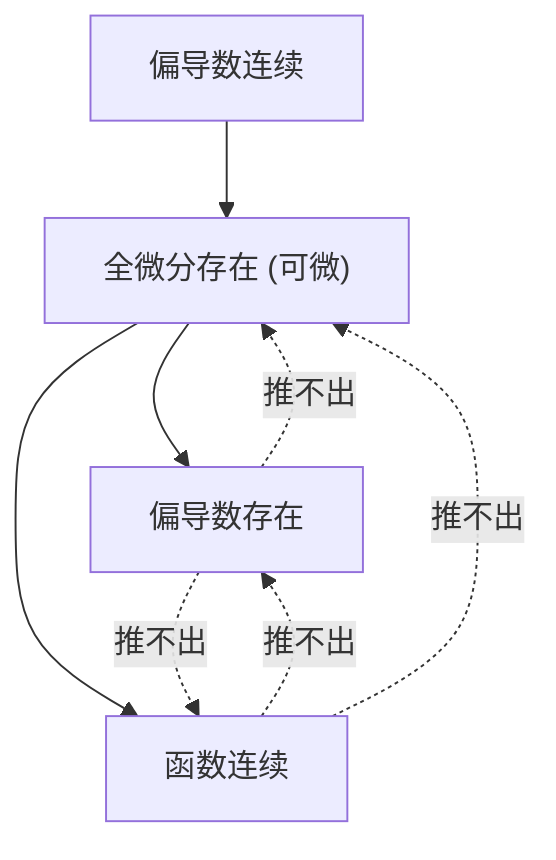

# chap13 多元函数微分学

## 1. 二元函数的极限与连续性

#### 1. 二重极限的严格定义:
设函数 $z = f(x, y)$ 在点 $P_0(x_0, y_0)$ 的某去心邻域内有定义.
$$\lim_{(x,y) \to (x_0,y_0)} f(x,y) = L \iff \forall \varepsilon > 0, \exists \delta > 0, \text{ 当 } 0 < \sqrt{(x-x_0)^2+(y-y_0)^2} < \delta \text{ 时, 恒有 } |f(x,y) - L| < \varepsilon$$
>   **几何与运算内涵:**
>   - 动点 $(x,y)$ 是在平面内以**任意可能路径、任意方式**趋向于定点 $(x_0, y_0)$
>   - **路径法证明极限不存在:** 若沿两条不同路径 (如直线 $y = kx$ 或抛物线 $y = kx^2$) 趋近所得极限与斜率 $k$ 相关, 或极限不相等, 则二重极限必不存在.

#### 2. 二元连续性与有界闭区域性质:
- 连续定义: $\lim_{(x,y) \to (x_0,y_0)} f(x,y) = f(x_0, y_0)$
- 闭区域连续性质: 在有界闭区域 $D$ 上的连续函数必满足**有界性定理**、**最大值最小值定理**和**介值定理**.

---

## 2. 偏导数与全微分体系

#### 1. 偏导数的严格定义:
$$f_x(x_0, y_0) = \left.\frac{\partial z}{\partial x}\right|_{(x_0,y_0)} = \lim_{\Delta x \to 0} \frac{f(x_0+\Delta x, y_0) - f(x_0, y_0)}{\Delta x}$$
$$f_y(x_0, y_0) = \left.\frac{\partial z}{\partial y}\right|_{(x_0,y_0)} = \lim_{\Delta y \to 0} \frac{f(x_0, y_0+\Delta y) - f(x_0, y_0)}{\Delta y}$$
>   **几何意义:** 偏导数 $f_x(x_0, y_0)$ 表示曲面 $z = f(x,y)$ 被平面 $y = y_0$ 所截得的截痕曲线在点 $P_0$ 处对 $x$ 轴的切线斜率.

#### 2. 全微分的定义与判定准则:
- **严格定义:** 若全增量 $\Delta z = f(x_0+\Delta x, y_0+\Delta y) - f(x_0, y_0)$ 可表示为:
  $$\Delta z = A\Delta x + B\Delta y + o(\rho) \quad \left(\rho = \sqrt{\Delta x^2 + \Delta y^2} \to 0\right)$$
  其中 $A, B$ 是与 $\Delta x, \Delta y$ 无关的常数, 则称函数在点 $(x_0, y_0)$ 处**可微**, 其全微分记为:
  $$dz = A dx + B dy = \frac{\partial z}{\partial x}dx + \frac{\partial z}{\partial y}dy$$

#### 3. 可微性判定三步法 (必考规范流程):
1. **Step 1:** 由偏导数定义计算偏导数 $f_x(x_0, y_0)$ 与 $f_y(x_0, y_0)$
2. **Step 2:** 列出误差比值极限:
   $$\lim_{(\Delta x, \Delta y) \to (0,0)} \frac{f(x_0+\Delta x, y_0+\Delta y) - f(x_0, y_0) - [f_x(x_0, y_0)\Delta x + f_y(x_0, y_0)\Delta y]}{\sqrt{\Delta x^2 + \Delta y^2}}$$
3. **Step 3:** 计算该二重极限:
   - 若极限值**等于 0** $\implies$ 函数在 $(x_0, y_0)$ 处**可微**;
   - 若极限值**不为 0 或不存在** $\implies$ 函数**不可微**.

---

## 3. 多元微积分核心概念关系全景图

---

## 4. 多元复合函数求导法则 (链式法则)

#### 1. 变量关系树状图法则:
设 $z = f(u, v)$, 其中 $u = u(x, y), v = v(x, y)$, 则:
$$\frac{\partial z}{\partial x} = \frac{\partial z}{\partial u}\frac{\partial u}{\partial x} + \frac{\partial z}{\partial v}\frac{\partial v}{\partial x}, \quad \frac{\partial z}{\partial y} = \frac{\partial z}{\partial u}\frac{\partial u}{\partial y} + \frac{\partial z}{\partial v}\frac{\partial v}{\partial y}$$

#### 2. 高阶偏导数与克莱罗定理 (Clairaut):
若二阶混合偏导数 $f_{xy}(x,y)$ 与 $f_{yx}(x,y)$ 在区域内连续, 则混合偏导数与求导次序无关:
$$\frac{\partial^2 z}{\partial x \partial y} = \frac{\partial^2 z}{\partial y \partial x}$$

---

## 5. 隐函数求导法与隐函数存在定理

#### 1. 单个方程确定的隐函数求导公式:
1. 由 $F(x, y) = 0$ 确定 $y = y(x) \implies \frac{dy}{dx} = -\frac{F_x}{F_y} \ (F_y \neq 0)$
2. 由 $F(x, y, z) = 0$ 确定 $z = z(x, y)$:
   $$\frac{\partial z}{\partial x} = -\frac{F_x}{F_z}, \quad \frac{\partial z}{\partial y} = -\frac{F_y}{F_z} \ (F_z \neq 0)$$

#### 2. 方程组确定的隐函数求导 (雅可比行列式):
由 $\begin{cases} F(x, y, u, v) = 0 \\ G(x, y, u, v) = 0 \end{cases}$ 确定 $u = u(x,y), v = v(x,y)$:
$$\frac{\partial u}{\partial x} = -\frac{\frac{\partial(F,G)}{\partial(x,v)}}{\frac{\partial(F,G)}{\partial(u,v)}} = -\frac{\det\begin{pmatrix} F_x & F_v \\ G_x & G_v \end{pmatrix}}{\det\begin{pmatrix} F_u & F_v \\ G_u & G_v \end{pmatrix}}$$

---

## 6. 多元函数的极值与最值

#### 1. 无条件极值判定 (黑塞矩阵判别法 Hessian):
1. **必要条件:** 设 $(x_0, y_0)$ 为极值点且偏导数存在, 则必为驻点: $f_x(x_0, y_0) = 0, f_y(x_0, y_0) = 0$.
2. **二阶充分条件:** 令 $A = f_{xx}(x_0,y_0), B = f_{xy}(x_0,y_0), C = f_{yy}(x_0,y_0), \Delta = AC - B^2$:
   - 若 $\mathbf{AC - B^2 > 0}$:
     - $A > 0 \implies$ 该点取得**极小值**
     - $A < 0 \implies$ 该点取得**极大值**
   - 若 $\mathbf{AC - B^2 < 0} \implies$ **不是极值点** (鞍点 Saddle Point)
   - 若 $\mathbf{AC - B^2 = 0} \implies$ **判别法失效**, 需借助定义或局部展开讨论

#### 2. 条件极值与拉格朗日乘数法 (Lagrange Multipliers):
求目标函数 $u = f(x, y, z)$ 在约束条件 $\varphi(x, y, z) = 0$ 下的极值:
1. 构造拉格朗日函数: $L(x, y, z, \lambda) = f(x, y, z) + \lambda \varphi(x, y, z)$
2. 联立一阶偏导数方程组:
   $$\begin{cases} L_x = f_x + \lambda \varphi_x = 0 \\ L_y = f_y + \lambda \varphi_y = 0 \\ L_z = f_z + \lambda \varphi_z = 0 \\ L_\lambda = \varphi(x, y, z) = 0 \end{cases}$$
3. 解方程组求出候选极值点坐标, 结合实际物理/几何背景确定最大值与最小值.

---

## 7. 易错点与典型陷阱分析

1. **二元函数偏导存在误推连续:** 偏导存在仅代表沿平行坐标轴两条直线的极限存在, 无法保证全平面任意路径趋近连续.
2. **复合函数求导记号混淆:** 如 $f(x+y, xy)$ 对 $x$ 求导必须写为 $f'_1 \cdot 1 + f'_2 \cdot y$, 切勿直接写成 $f'(x+y)$.
3. **极值判别式符号记反:** $\Delta = AC - B^2 > 0$ 才是极值存在条件, 误记为 $B^2 - AC$.
