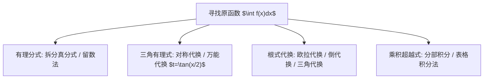

# chap20 附录: 如何寻找原函数

## 1. 原函数寻找核心思维导图

---

## 2. 欧拉代换 (Euler Substitution) 全解

针对含有二次根式 $\sqrt{ax^2 + bx + c}$ 的积分:
1. **欧拉第一代换 ($a > 0$):**
   令 $\sqrt{ax^2 + bx + c} = \sqrt{a}x + t \implies x = \frac{t^2 - c}{b - 2\sqrt{a}t}$, 将无理式完全有理化.
2. **欧拉第二代换 ($c > 0$):**
   令 $\sqrt{ax^2 + bx + c} = xt + \sqrt{c} \implies x = \frac{2\sqrt{c}t - b}{a - t^2}$.
3. **欧拉第三代换 (二次式有实根 $\alpha, \beta$):**
   令 $\sqrt{a(x-\alpha)(x-\beta)} = t(x - \alpha) \implies x = \frac{a\beta - \alpha t^2}{a - t^2}$.

---

## 3. 分部积分循环降幂与线性方程组法

#### 1. 经典循环结构:
$$I = \int e^{ax}\cos bx dx \implies \text{两次分部积分得 } I = \text{多项式} - \frac{b^2}{a^2} I \implies I = \frac{e^{ax}(a\cos bx + b\sin bx)}{a^2 + b^2} + C$$

#### 2. 三角函数降幂递推公式:
$$I_n = \int \sin^n x dx = -\frac{1}{n}\sin^{n-1}x\cos x + \frac{n-1}{n}I_{n-2}$$
$$J_n = \int \cos^n x dx = \frac{1}{n}\cos^{n-1}x\sin x + \frac{n-1}{n}J_{n-2}$$
