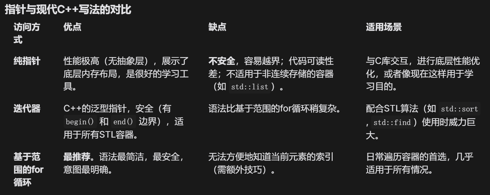

# 3000. 对角线最长的矩形的面积
      
简单
      
给你一个下标从 0 开始的二维整数数组 dimensions。

对于所有下标 `i（0 <= i < dimensions.length）`

`dimensions[i][0]` 表示矩形 i 的长度，而 `dimensions[i][1]` 表示矩形 i 的宽度。

返回对角线最长的矩形的面积 。如果存在多个对角线长度相同的矩形，返回面积最大的矩形的面积。

##### 示例 1：

输入：dimensions = [[9,3],[8,6]]

输出：48

解释：
>下标 = 0，长度 = 9，宽度 = 3。对角线长度 = sqrt(9 * 9 + 3 * 3) = sqrt(90) ≈ 9.487。
>
>下标 = 1，长度 = 8，宽度 = 6。对角线长度 = sqrt(8 * 8 + 6 * 6) = sqrt(100) = 10。

因此，下标为 1 的矩形对角线更长，所以返回面积 = 8 * 6 = 48。

##### 示例 2：

输入：dimensions = [[3,4],[4,3]]

输出：12

>解释：两个矩形的对角线长度相同，为 5，所以最大面积 = 12。

提示：

1 <= dimensions.length <= 100

dimensions[i].length == 2

1 <= dimensions[i][0], dimensions[i][1] <= 100

