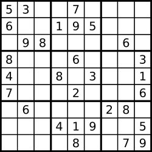

## 37. 解数独 
困难

编写一个程序，通过填充空格来解决数独问题。

数独的解法需 遵循如下规则：

数字 1-9 在每一行只能出现一次。

数字 1-9 在每一列只能出现一次。

数字 1-9 在每一个以粗实线分隔的 3x3 宫内只能出现一次。（请参考示例图）
数独部分空格内已填入了数字，空白格用 '.' 表示。


示例 1：

输入： 
```cpp
board = [["5","3",".",".","7",".",".",".","."],
         ["6",".",".","1","9","5",".",".","."],
         [".","9","8",".",".",".",".","6","."],
         ["8",".",".",".","6",".",".",".","3"],
         ["4",".",".","8",".","3",".",".","1"],
         ["7",".",".",".","2",".",".",".","6"],
         [".","6",".",".",".",".","2","8","."],
         [".",".",".","4","1","9",".",".","5"],
         [".",".",".",".","8",".",".","7","9"]]
```
输出：
```cpp
``[["5","3","4","6","7","8","9","1","2"],
   ["6","7","2","1","9","5","3","4","8"],
   ["1","9","8","3","4","2","5","6","7"],
   ["8","5","9","7","6","1","4","2","3"],
   ["4","2","6","8","5","3","7","9","1"],
   ["7","1","3","9","2","4","8","5","6"],
   ["9","6","1","5","3","7","2","8","4"],
   ["2","8","7","4","1","9","6","3","5"],
   ["3","4","5","2","8","6","1","7","9"]]
```
解释：输入的数独如上图所示，唯一有效的解决方案如下所示：


提示：

board.length == 9

board[i].length == 9

board[i][j] 是一位数字或者 '.'

题目数据 保证 输入数独仅有一个解